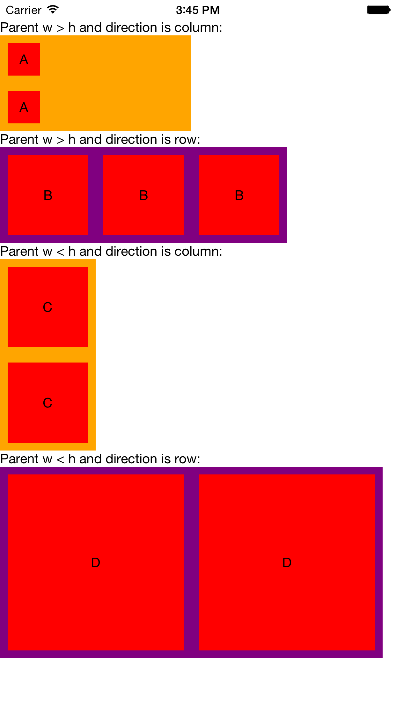

# react-native-square-view
A square view component for react native.

## Screen Shot



## Installation

1. Run `npm install react-native-square-view --save` in your project directory.
2. Add `var SquareView = require('react-native-square-view');` to your code.

## Usage

```javascript
'use strict';

var React = require('react-native');
var {
  AppRegistry,
  StyleSheet,
  Text,
  View,
  ScrollView
} = React;
var SquareView = require('react-native-square-view');

var SquareViewDemo = React.createClass({
  render: function() {
    return (
      <ScrollView style={styles.container} contentInset={{top: 20}}>
        <Text>Parent w {'>'} h and direction is column:</Text>
        <View style={{width: 200, height: 100, backgroundColor: 'orange'}}>
          <SquareView style={{flex: 1, margin: 8, alignItems: 'center', justifyContent: 'center'}}>
            <Text>A</Text>
          </SquareView>
          <SquareView style={{flex: 1, margin: 8, alignItems: 'center', justifyContent: 'center'}}>
            <Text>A</Text>
          </SquareView>
        </View>

        <Text>Parent w {'>'} h and direction is row:</Text>
        <View style={{width: 200, height: 100, backgroundColor: 'purple', flexDirection: 'row'}}>
          <SquareView style={{flex: 1, margin: 8, alignItems: 'center', justifyContent: 'center'}}>
            <Text>B</Text>
          </SquareView>
          <SquareView style={{flex: 1, margin: 8, alignItems: 'center', justifyContent: 'center'}}>
            <Text>B</Text>
          </SquareView>
          <SquareView style={{flex: 1, margin: 8, alignItems: 'center', justifyContent: 'center'}}>
            <Text>B</Text>
          </SquareView>
        </View>

        <Text>Parent w {'<'} h and direction is column:</Text>
        <View style={{width: 100, height: 200, backgroundColor: 'orange'}}>
          <SquareView style={{flex: 1, margin: 8, alignItems: 'center', justifyContent: 'center'}}>
            <Text>C</Text>
          </SquareView>
          <SquareView style={{flex: 1, margin: 8, alignItems: 'center', justifyContent: 'center'}}>
            <Text>C</Text>
          </SquareView>
        </View>

        <Text>Parent w {'<'} h and direction is row:</Text>
        <View style={{width: 100, height: 200, backgroundColor: 'purple', flexDirection: 'row'}}>
          <SquareView style={{flex: 1, margin: 8, alignItems: 'center', justifyContent: 'center'}}>
            <Text>D</Text>
          </SquareView>
          <SquareView style={{flex: 1, margin: 8, alignItems: 'center', justifyContent: 'center'}}>
            <Text>D</Text>
          </SquareView>
        </View>

      </ScrollView>
    );
  }
});

var styles = StyleSheet.create({
  container: {
    flex: 1
  }
});

AppRegistry.registerComponent('SquareViewDemo', () => SquareViewDemo);
```

---

## License

Available under the MIT license. See the LICENSE file for more informatiion.